# rethink-chat

Rethink-chat es una aplicación de mensajería realizada para un trabajo enmarcado en la asigantura Complemento de Bases de Datos.

La aplicación se encuentra desplegada en: [rethink-chat](https://rethink-chat-production.up.railway.app/)

A continuación se explicará cómo instalar y arrancar el sistema de varias formas ([Linux](#instalación-en-linux-ubuntu) o [Windows](#instalación-en-windows)).

Ademas, se explicará cómo utilizar la aplicacón en la sección [Manual de usuario](#manual-de-usuario).

## Instalación en Linux (Ubuntu)

Para la instalación y arranque del sistema tenemos dos opciones, una que implica el uso de Docker y Docker Compose, de forma que con levantar el contenedor es suficiente, y otra sin docker.

### Docker + Docker compose

En primer lugar, necesitaremos tener docker y docker compose instalados.

#### **1. Intalación de Docker y Docker Compose**
Hay que seguir los siguientes pasos:


#### Actualizar el sistema
```
sudo apt update && sudo apt upgrade -y

```

#### Instalar Docker

```
curl -fsSL https://get.docker.com -o get-docker.sh
sudo sh get-docker.sh
```

#### Agregar usuario al grupo docker (para no usar sudo)
```
sudo usermod -aG docker $USER
```

#### Cerrar sesión y volver a entrar, o ejecutar:
```
newgrp docker
```

#### Verificar instalación
```
docker --version
docker compose version
```

#### **2. Clonar el repositorio**
```
git clone https://github.com/Cristinafernandezchica/rethink-chat.git
```

#### Ir a la rama 'docker'
```
git fetch 
git checkout docker
```

#### Crear archivo .env
```
cat > .env << 'EOF'
NODE_ENV=production
PORT=3000
JWT_SECRET=clave_segura_cambiar_en_produccion_$(openssl rand -base64 32)
RETHINK_HOST=rethinkdb
RETHINK_PORT=28015
RETHINK_DB=rethinkchat
ADMIN_USERNAME=admin
ADMIN_PASSWORD=admin123
EOF

```

#### **3. Levantar la aplicación**
```
docker compose up -d
```

#### Verificamos que funciona

```
docker compose ps

curl http://localhost:3000/health
```

#### **4. Abrir navegador en http://localhost:3000**

Para este caso, como se ha configurado en el .env las credenciales del usuario administrador que se crea por defecto son:

```
Usuario: admin
Contraseña: admin123
```

Se podrá acceder a la interfaz gráfica de RethinkDB desde http://localhost:8081

### Instalación manual

#### **1. Instalar Node.js**

```
# Instalar Node.js 20.x (versión LTS)
curl -fsSL https://deb.nodesource.com/setup_20.x | sudo -E bash -
sudo apt-get install -y nodejs

# Verificar
node --version  # v20.x
npm --version   # 10.x
```

#### **2. Instalar RethikDB**
```
# Agregar repositorio de RethinkDB
source /etc/lsb-release
echo "deb https://download.rethinkdb.com/repository/ubuntu-$DISTRIB_CODENAME $DISTRIB_CODENAME main" | sudo tee /etc/apt/sources.list.d/rethinkdb.list

# Agregar clave GPG
wget -qO- https://download.rethinkdb.com/repository/raw/pubkey.gpg | sudo apt-key add -

# Instalar
sudo apt-get update
sudo apt-get install -y rethinkdb

# Iniciar servicio
sudo systemctl enable rethinkdb
sudo systemctl start rethinkdb

# Verificar
sudo systemctl status rethinkdb
```

#### **3. Instalar y configurar el proyecto**

```
# Clonar el repositorio
git clone https://github.com/Cristinafernandezchica/rethink-chat.git
cd rethink-chat

# Asegurarse de estar en la rama principal
git checkout master

# Instalar dependencias
npm install

# Crear archivo .env
cat > .env << 'EOF'
NODE_ENV=development
PORT=3000
JWT_SECRET=mi_clave_secreta_para_desarrollo_12345
RETHINK_HOST=localhost
RETHINK_PORT=28015
RETHINK_DB=rethinkchat
ADMIN_USERNAME=admin
ADMIN_PASSWORD=admin123
EOF
```

#### **4. Inicializar la base de datos**
```
# Arrancar rethinkdb (desde una terminal)
rethinkdb

# Crear tablas e índices
npm run initdb

# (Opcional) Si quieres resetear la DB más tarde:
npm run reset-db
```

En caso de conflictos en la base de datos, ejecutar el reseteo de la misma como solución rápida.

#### **5. Ejecutar la aplicación**
```
# Modo desarrollo (con auto-reload)
npm run dev

# O modo producción
npm start
```

#### **6. Acceder a la aplicación**

+ **rethink-chat**: http://localhost:3000
+ **rethinkdb**: http://localhost:8080

Para este caso, el usuario administrador de la aplicación se creará con las siguientes credenciales:
```
Usuario: admin
Contraseña: admin
```

En caso de saltar un error en las credenciales, usar las mismas credenciales que para el resto de instalaciones:

```
Usuario: admin
Contraseña: admin123
```


## Instalación en Windows

Existe la opción de levantar el contenedor docker en Windows, pero no es recomendable utilizar esta opción ya que no ha podido ser probada al 100%. Los pasos a seguir son:

### Docker Desktop

#### **1. Descargar e instalar Docker Desktop**
Esto se puede hacer desde la Microsoft Store o desde la página oficial de docker https://www.docker.com/products/docker-desktop/.

#### Habilitamos WSL
Durante la instalación de Docker Desktop, se recomienda activar WSL 2. Tras esto, se debe reiniciar.

#### **2. Abrir PowerShell con permisos de Administrador**
En la consola debemos ejecutar lo siguiente:
```
wsl --update
wsl --set-default-version 2
``` 

#### **3. Abrimos Docker Desktop**

#### **4. Clonamos el repositorio**

```
git clone https://github.com/Cristinafernandezchica/rethink-chat.git
```

#### **5. Creamos el .env**
En la rama `docker`, creamos el .env con el siguiente contenido:
```
NODE_ENV=production
PORT=3000
JWT_SECRET=clave_segura_windows_12345
RETHINK_HOST=rethinkdb
RETHINK_PORT=28015
RETHINK_DB=rethinkchat
ADMIN_USERNAME=admin
ADMIN_PASSWORD=admin123
```

#### **6. Levantamos la aplicación**

```
docker compose up -d
```

#### Verficamos el estado

```
docker compose ps
```

#### **7. Abrimos la aplicación en http://localhost:3000**


## Manual de usuario

A continuación, se va a explicar el funcionamiento de cada una de las funcionalidades de la aplicación, para poder hacer uso de la misma.

### Registro/Inicio de sesión

En primer lugar tenemos la pantalla de registro e inicio de sesión. Para registrarnos en la aplicación, utilizamos un nombre de usuario. Una vez registrados, tendremos que iniciar sesión. El registro no inicia sesión automáticamente, nos a parecerá un mensaje: "Cuenta creada. AHora inicia sesión.".

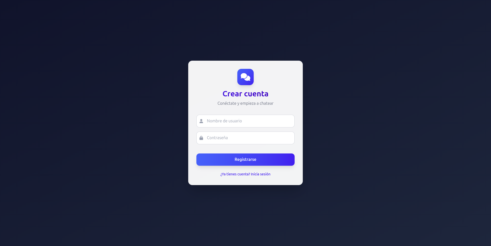

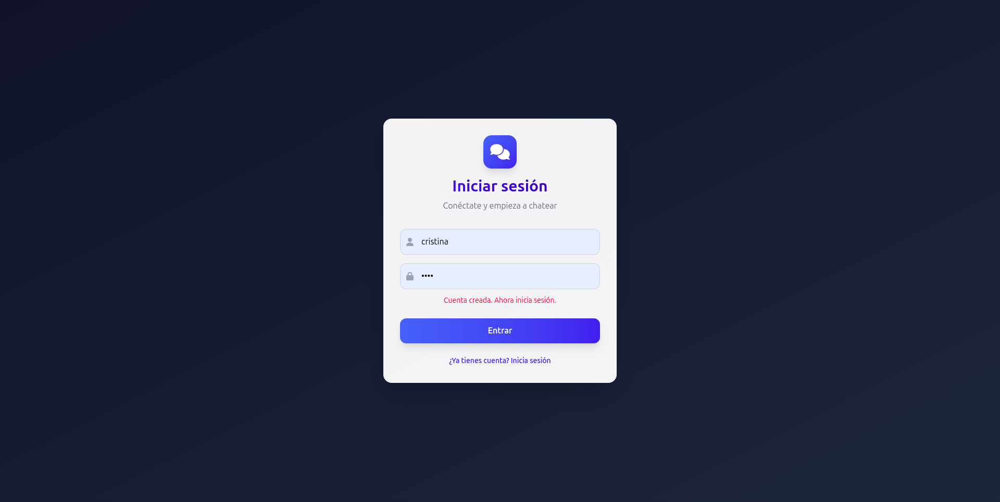

### Chat general

Nada más iniciar sesión, nos aparecerá el chat general de la aplicación, donde todos los usuarios pueden mandar mensajes:

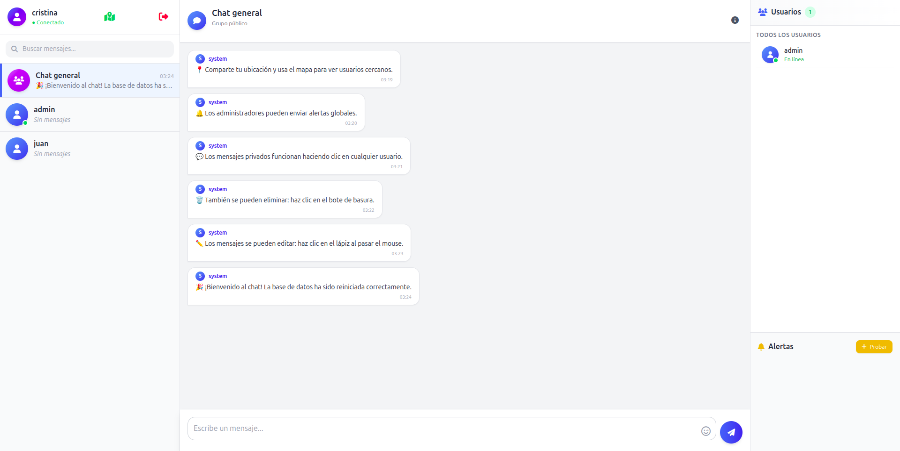

Aquí tendremos varios mensajes predeterminados que explican las funcionalidades básicas de la aplicación. Desde aquí podemos enviar mensajes, editarlos o eliminarlos:


La edición se realizará mediante un modal:

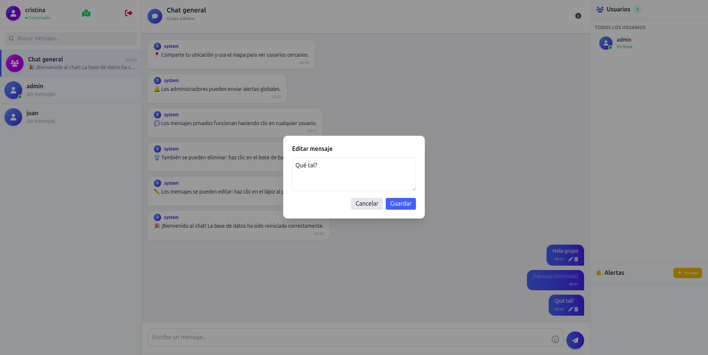

Además, al eliminar o editar un mensaje nos aparecerá una alerta efíera en la ventana de alertas de la esquina inferior derecha.

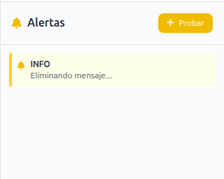     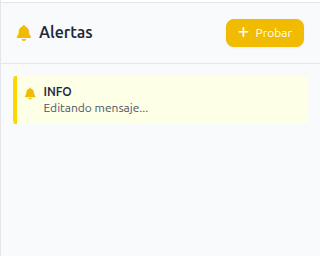

### Mensajes privados

Podemos enviar mensajes a usuarios específicos de la aplicación, seleccionádolo en el sidebar izquierdo. De igual forma que en el chat general, podemos enviar mensajes, borrarlos o editarlos.

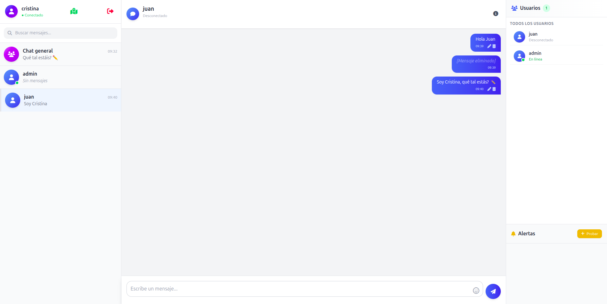

En los chats privados, si no has leído el mensaje te aparecerá el contador de mensajes sin leer en el chat correspondiente de la siguiente manera:

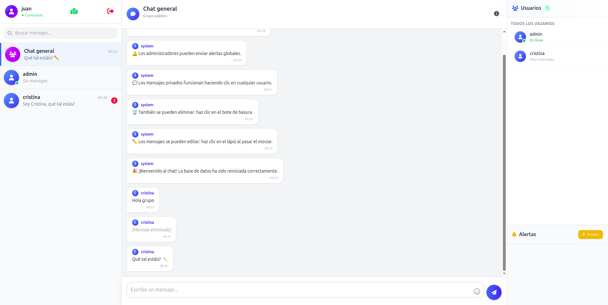

### Usuarios online

El estado de los usuarios en el aplicación lo podemos ver en el sidebar izquierdo, mediante los puntos verdes en el icono de aquellos usuarios que se encuentran en línea, o en el sidebar izquierdo, que es la sección verdaderamente dedicada a ello.

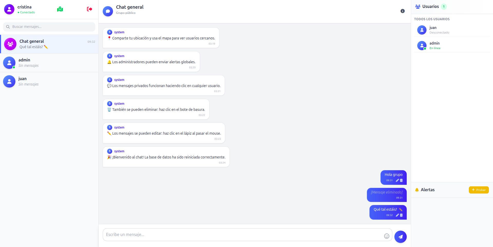

### Alertas

Desde el usuario administrador podremos enviar alertas a todos los usuarios del sistema. Esto lo podremos hacer mediante las acciones que encontramos en la esquina inferior derecha desde el usuario administrador:

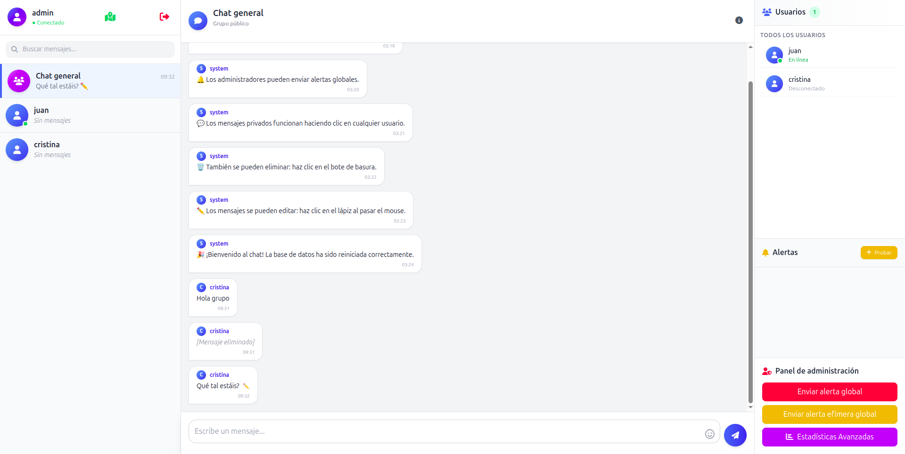


Desde aquí, podremos enviar alertas globales persistentes para todos los usuarios, o alertas efímeras (desaparecen a los 3 segundos):

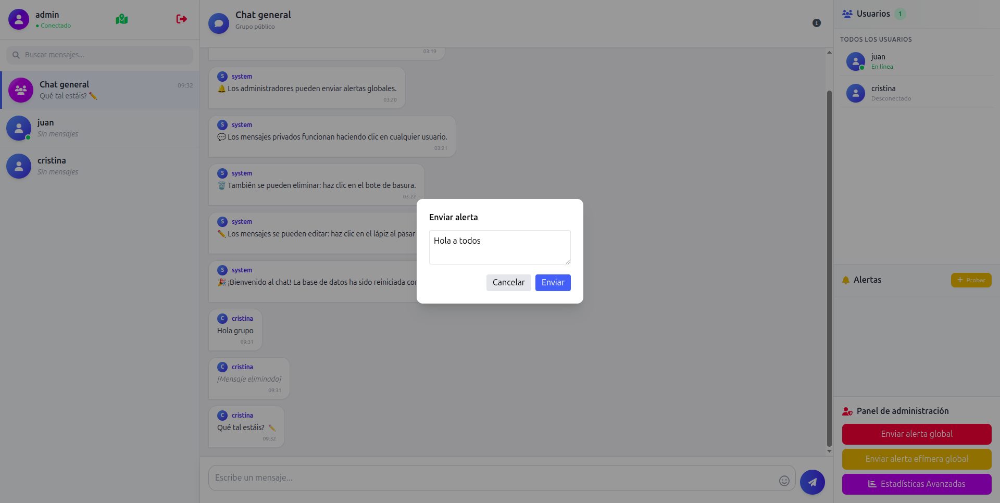

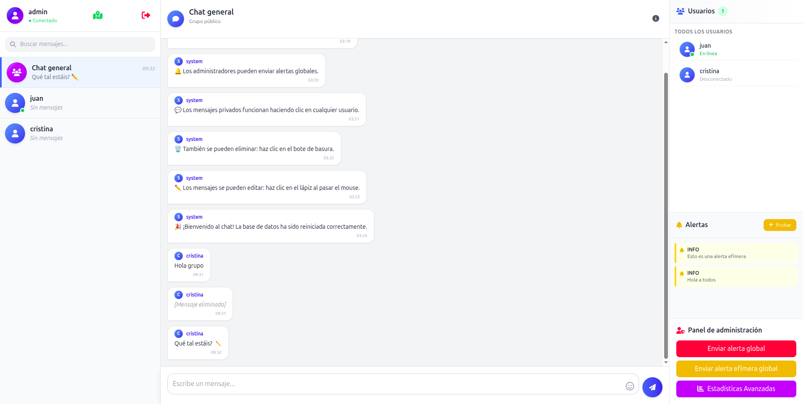


### Geolocalización

Otra de las funcionalidades implementadas, es un mapa donde se pueden ver los usuarios cercanos. A este podemos acceder desde el icono del mapa en el sidebar izquierdo, en la parte superiro. Veremos algo así al entrar:

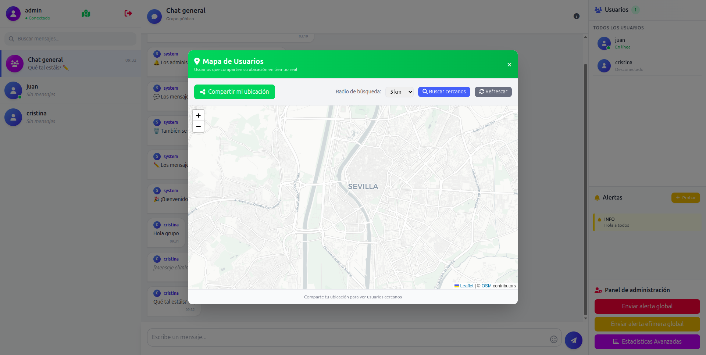

Desde aquí, si compartimos la ubicación, apareceremos ubicados en el mapa, de la siguiente manera:

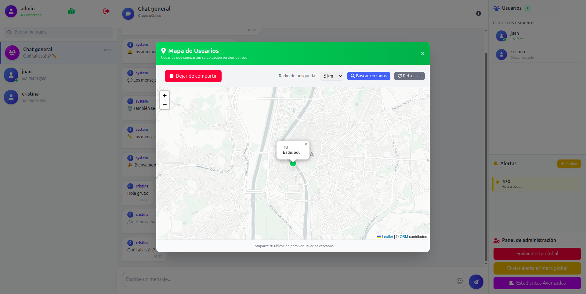

Además, podremos hacer una búsqueda de los usuarios cercanos, puediendo filtrar por ratio hasta 25km. Si nos vamos a otro usuario, y hacemos búsqueda de los usuarios cercanos, nos aparecerá el resto de usuarios activosa nuestro alrededor:

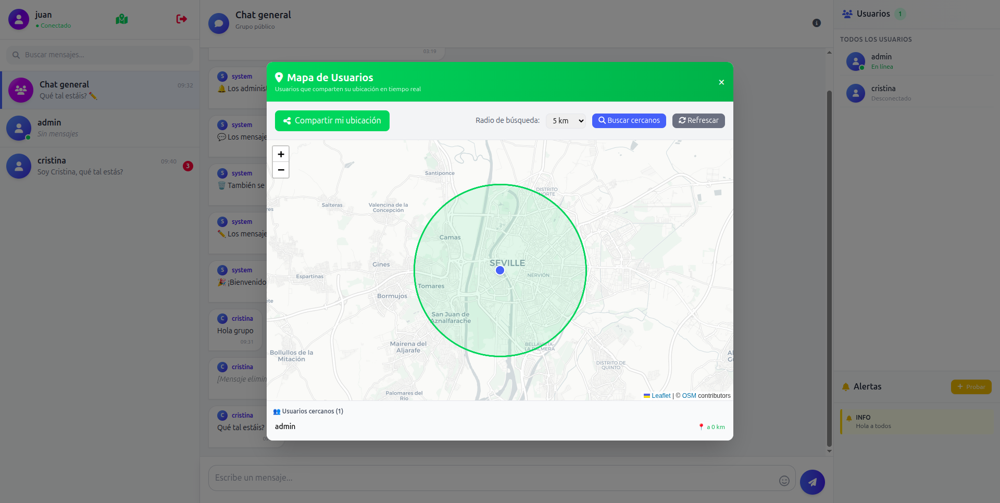

### Estadísticas

Por último, tenemos la funcionalidad que nos ofrece varias estadísticas de uso de la aplicación. Estas solo son accesibles desde el perfil de usuario administrador. Se accede mediante el botón "Estadísticas avanzadas" que está junto al envío de las alertas. Tienen el siguiente aspecto:

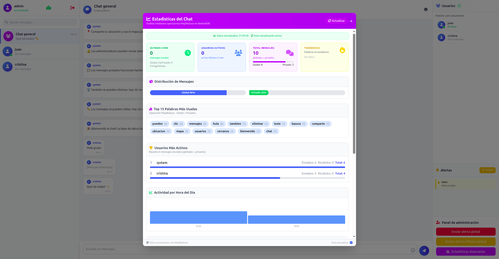

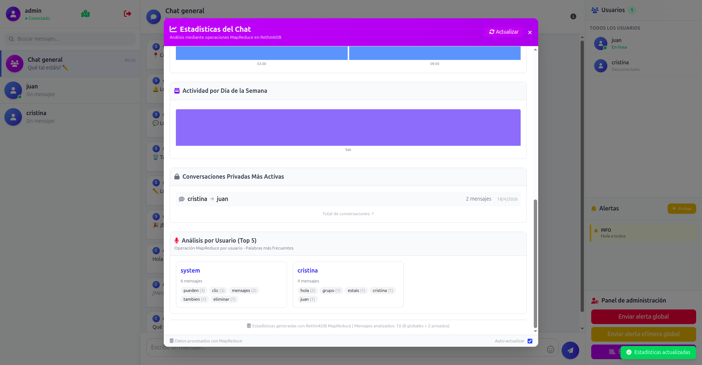